This project is a three-month effort to build a self-driving system that works end-to-end on a real mini car. We integrated the whole system, enabling the car to localize itself, plan a path, and physically drive to a destination I selected.

<!-- The motivation for me behind is simple: curiosity and interest.

I wanted to build an intelligent system that actually runs in the real world—where I can see the results, observe it, and iteratively evolve it; where I can imagine the prospect and the future of something I made with my own hands. That’s cool.

Watching the car succeed, get stuck, and gradually run better over time was the most meaningful part of this project. And it’s this process that forms the most valuable engineering experience. -->

## Overview

The system follows a classic autonomous driving stack:

- **Localization**: State estimation from a noisy sensor.
- **Planning**: Path planning on a known map.
- **Control**: Tracking the planned path on a physical car.

Data flow:

```mermaid
flowchart TB
    %% Strict Top-Down Layout
    
    %% --- Top Layer: Inputs ---
    subgraph Inputs [ ]
        direction LR
        style Inputs fill:none,stroke:none
        Sensors([📡 Sensors<br/>Lidar & Odom])
        User([👤 User<br/>Selection])
        Map([🗺️ Map<br/>Data])
    end

    %% --- Middle Layer: Stack (Vertical) ---
    %% We group them but rely on edges to enforce order
    subgraph Stack [Autonomous System]
        direction TB
        Plan[🛣️ Planning<br/><b>PRM + Lazy A*</b>]
        Ctrl[🎮 Control<br/><b>MPC</b>]
        Loc[📍 Localization<br/><b>Particle Filter</b>]
    end

    %% --- Bottom Layer: Output ---
    Car((🏎️ Real Car<br/>Control))

    %% === Positioning Force (Hidden Edges) ===
    %% These ensure the vertical backbone: Plan -> Ctrl -> Loc -> Car
    %% We anchor the stack under the middle input (User)
    User ~~~ Plan
    Plan ~~~ Ctrl
    Ctrl ~~~ Loc
    Loc ~~~ Car
    
    %% Force Sensors to be left, Map to be right (relative to stack)
    Sensors ~~~ Plan
    Map ~~~ Plan

    %% === Real Data Flow ===
    Sensors -->|"Raw Data"| Loc
    Sensors -->|"Real-time Obstacles"| Ctrl
    User -->|"Target Destination"| Plan
    Map -->|"Static Obstacles"| Loc
    Map -->|"Free Space"| Plan
    
    %% Loc is now at bottom, providing feedback UP to Plan and Ctrl
    Loc -->|"Current Pose"| Plan
    Loc -->|"Current Pose"| Ctrl
    
    Plan -->|"Trajectory / Path"| Ctrl
    
    Ctrl -->|"Speed & Steering"| Car
    
    %% === Styling ===
    classDef input fill:#e3f2fd,stroke:#1565c0,stroke-width:2px,color:#0d47a1
    classDef module fill:#f3e5f5,stroke:#7b1fa2,stroke-width:2px,color:#4a148c
    classDef output fill:#ffb74d,stroke:#e65100,stroke-width:4px,color:#000000,font-weight:bold,font-size:16px
    
    class User,Map,Sensors input
    class Loc,Plan,Ctrl module
    class Car output
```

The Multi-agent System for non-Holonomic Racing (MuSHR) is an open-source robotic hardware and software platform from University of Washington for learning and researching AI in the setting of autonomous vehicles and mobile robotics.

[MuSHR: The UW Open Racecar Project](https://mushr.io/)

## Highlights

### Real-time Obstacle Avoidance

**Motivation:** The baseline controller only tracks the pre-planned path, sometimes it collides with walking pedestrians or unmapped obstacles.

**Idea:** To use existing LiDAR measurements to detect obstacles, convert their coordinates, and then penalize the candidate trajectories that are too close to the obstacles in MPC cost function.

### Smooth Path Following

**Motivation:** The original MPC often **oscillates** (keeps steering left/right), which reduces the stability and comfort.

**Idea:** Add a steering smoothness penalty as a cost function to the MPC algorithm.

```mermaid
flowchart TB
    %% --- Top Layer: Inputs ---
    subgraph Inputs [ ]
        direction LR
        style Inputs fill:none,stroke:none
        I_Scan([<b>LiDAR Data</b>])
        I_Loc([<b>Current Pose</b><br/>from Localization])
        I_Plan([<b>Planned Path</b><br/>from Planning])
        I_Map([<b>Static Map</b>])
    end

    %% --- Middle Layer: MPC Module ---
    subgraph MPC [<b>MPC Controller</b>]
        direction TB
        
        %% Step 1: Trajectory Generation
        Generate[🎲 <b>Generate K Future Path Candidates</b>]

        %% Step 2: Cost Evaluation (Detailed)
        subgraph Costs [Cost Evaluation]
            direction TB
            
            %% Standard Costs
            subgraph Standard [Standard Costs]
                direction LR
                style Standard fill:none,stroke:none
                C_Dist[<b>Distance Cost</b><br/>vs Reference Path]
                C_Map[<b>Map Collision Cost</b>]
            end
            
            %% Highlighted Improvements
            subgraph Highlights [<b>Key Improvements</b>]
                style Highlights fill:#fff3e0,stroke:#ffb74d,stroke-dasharray: 5 5
                C_Live[<b>Real-time Collision Cost</b>]
                C_Smooth[<b>Steering Smoothness Cost</b><br/>Penalize Steering Changes]
            end
        end

        %% Step 3: Selection
        Select[✅ <b>Optimization</b><br/>Select Min Cost Trajectory]
    end

    %% --- Bottom Layer: Output ---
    Car((🏎️\  Real Car<br/>Control))

    %% === Connections ===
    %% Inputs Flow
    I_Loc -->|"Current State"| Generate
    I_Plan -->|"Ref Speed"| Generate
    
    %% Cost Dependencies
    Generate -->|"Path Candidates"| C_Dist
    I_Plan -->|"Ref Path"| C_Dist
    
    Generate -->|"Path Candidates"| C_Map
    I_Map -->|"Static Map"| C_Map
    
    Generate -->|"Path Candidates"| C_Live
    I_Scan -->|"Real-time Obstacles"| C_Live
    
    Generate -->|"Steering Angles"| C_Smooth

    %% Aggregation
    C_Dist & C_Map & C_Live & C_Smooth -->  Select
    
    Select -->|"Speed & Steering"| Car

    %% === Styling ===
    classDef input fill:#e3f2fd,stroke:#1565c0,stroke-width:2px,color:#0d47a1
    classDef module fill:#f3e5f5,stroke:#7b1fa2,stroke-width:2px,color:#4a148c
    classDef highlight fill:#fff8e1,stroke:#ff8f00,stroke-width:3px,color:#bf360c
    classDef output fill:#ffb74d,stroke:#e65100,stroke-width:4px,color:#000000,font-weight:bold,font-size:16px
    classDef internal fill:#ffffff,stroke:#7b1fa2,stroke-width:1px,color:#4a148c
    
    class I_Plan,I_Loc,I_Scan,I_Map input
    class MPC module
    class C_Smooth,C_Live highlight
    class Generate,C_Dist,C_Map,Select internal
    class Car output
```

## Demonstration

### Real-time Obstacle Avoidance

