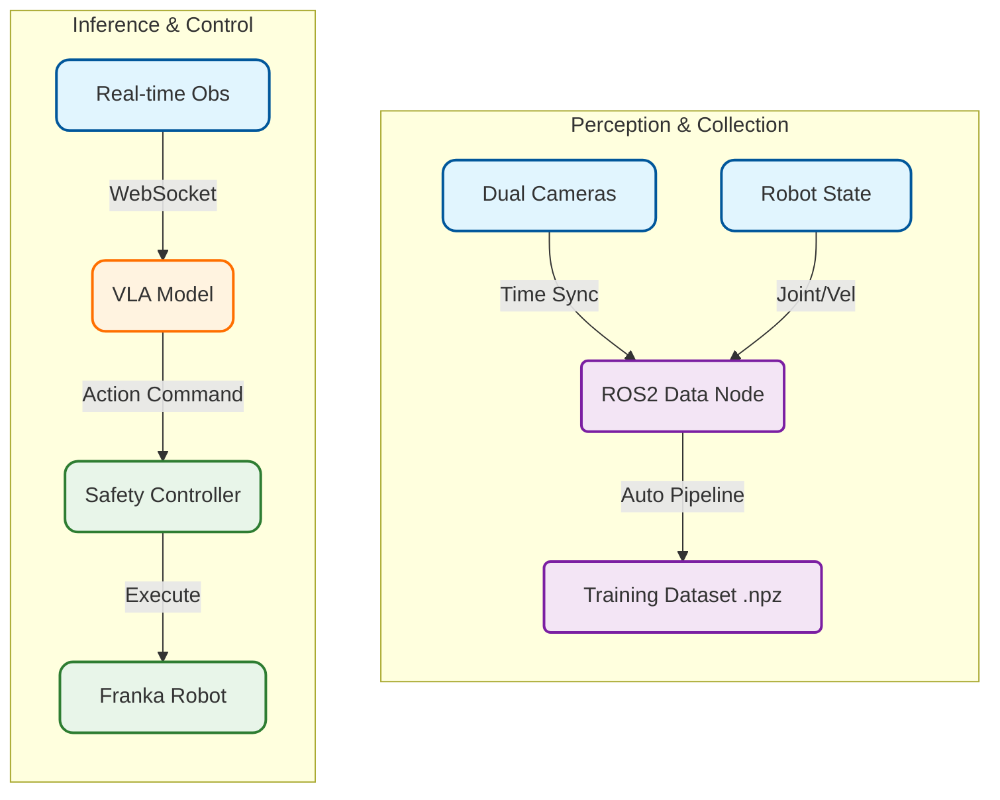

### Grasping Performance on Franka Robot

*Demonstration of object grasping using Pi0 VLA model on Franka robotic arm*

### Transfer to Humanoid Robot

*Successfully transferred the grasping capability to humanoid robot*

---

> Within 8 weeks, we built a complete fine-tuning system for the Pi0 VLA model and achieved stable grasping on real hardware.

**Project Duration**: 2025.03 - 2025.04  
**Role**: System Architecture Integration + Core Module Development + Data Collection Pipeline

---

## 1. Project Overview

This project aims to verify whether the **Pi0 VLA (Vision-Language-Action)** model can directly control a real robot to perform grasping tasks. In 8 weeks, we built a complete end-to-end closed-loop system, validating the entire process from data collection and model fine-tuning to real-world deployment.

**Core Contributions**:
*   **System Architecture**: Designed the ROS2 node communication architecture, implementing a closed-loop data flow from camera perception and model inference to controller execution.
*   **Automated Data Collection**: Designed an unattended automated pipeline (Auto-detection, Distortion Correction, Time Sync), resolving the inefficiency of manual collection.
*   **Real-time Safety Control**: Implemented Position/Velocity dual control modes, ensuring safety and stability via Joint Limit Protection, Max Delta Checks, and Gripper Logic Optimization.
*   **Engineering & Efficiency**: Developed one-click startup scripts and parallel training workflows, establishing version control standards to boost iteration speed.

---

## 2. System Architecture

The system consists of three main parts:
1.  **Perception**: Captures dual-camera images and robot states, transmitting them via ROS2.
2.  **Server**: Hosts the Pi0 VLA model, receiving observations and returning action commands.
3.  **Control**: Receives commands and controls the Franka robot motion via ROS2.

---

## 3. Key Technical Implementation

### 3.1 How to Teach the Model to Grasp? (Data Collection)

High-quality data is the prerequisite for model fine-tuning. Traditional manual demonstration is inefficient and lacks spatial coverage.

*   **Automated Collection**: We designed a state-machine-driven script that automatically cycles through `Reset -> Random Pose -> Grasp -> Lift`. This allows for unattended batch collection and ensures every trajectory is standardized.
*   **Preventing "Rote Memorization"**: To prevent the model from overfitting to fixed spatial coordinates, we introduced **Random Pose Noise** in the collection trajectories. By adding random offsets around target points, we force the model to focus on object features in the image rather than just memorizing joint angles.
*   **Image Consistency**: The model is sensitive to geometric distortion. We implemented a **Center Crop** pipeline, ensuring the raw camera feed maintains its aspect ratio when resized to 224x224. This eliminates stretching issues that could confuse the model.

### 3.2 How to Ensure Stability and Safety? (Real-time Control)

Model inference is probabilistic and can be noisy. Directly executing its output may lead to abrupt motions or safety violations. We designed an intermediate controller to ensure safety.

*   **Why Position Control?**: We initially tried Velocity Control but found that open-loop cumulative errors (integral drift) caused the robot to drift away from the target over long sequences. Switching to **Position Control** (sending absolute joint angles) eliminated this drift and significantly improved tracking accuracy.
*   **Safety Interception**: We embedded real-time monitoring logic in the controller. If any joint velocity or position command exceeds physical safety limits, the system triggers a **Fuse Mechanism** (Hard Stop) to prevent hardware damage.
*   **Jitter Suppression**: The model sometimes outputs flickering signals (e.g., the gripper toggling rapidly between open and close). We added a **State Filter** that only changes the gripper state after receiving consistent commands for multiple consecutive frames, ensuring smooth action.

---

## 4. Iteration & Optimization

This project completed the full cycle from setup to stable grasping within 8 weeks, going through 8 core iterations.

**Key Milestones**:

*   **Milestone 1: Automated Loop (2025-04-09)**
    *   Completed the automated pipeline, boosting daily collection efficiency by 5x and creating the first high-quality dataset (270 trajectories).
    *   *Result*: Model showed first signs of grasping intent (approaching objects).

*   **Milestone 2: Breaking the "Stagnation" Bottleneck (2025-04-10)**
    *   *Problem*: Robot tended to freeze when approaching objects.
    *   *Solution*: Increased Model Context Length from 50 to 300 frames to capture longer temporal dependencies.
    *   *Result*: Robot motion became fluid; **First successful grasp achieved**.

*   **Milestone 3: Control Strategy Refactor (2025-04-21)**
    *   *Problem*: Velocity control caused drift and instability over long durations.
    *   *Solution*: Switched underlying control strategy from **Velocity Mode** to **Position Mode** and rewrote gripper de-bouncing logic.
    *   *Result*: Achieved **Stable Grasping** state.
