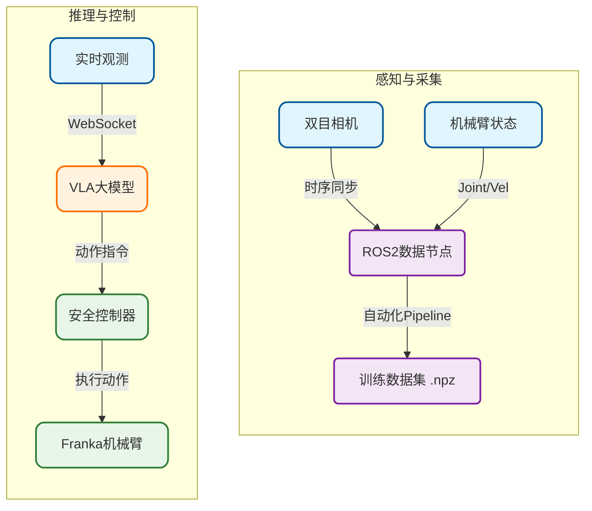

### Franka 机械臂抓取表现

*使用 Pi0 VLA 模型在 Franka 机械臂上进行物体抓取的演示*

### 迁移到人形机器人

*后续成功将抓取能力迁移至人形机器人平台*

---

# Franka 机械臂 Pi0 VLA 端到端抓取系统及训练报告

**项目时间**: 2025.03 - 2025.04  
**角色**: 系统架构集成 + 核心模块开发 + 全流程数据采集

---

## 1. 项目概述

本项目旨在验证 **Pi0 VLA (Vision-Language-Action)** 大模型能否直接控制真机完成抓取任务。我们在 8 周内构建了一套完整的端到端闭环系统，完成了从数据采集、模型微调到真机部署的全流程验证。

**核心贡献**：
*   **自动化数据采集**：设计了一套无人值守的自动化采集流程，解决了手动采集效率低的问题，并保证了数据的高质量。
*   **实时安全控制**：搭建了从模型推理到真机执行的桥梁，通过位置控制和安全拦截机制，实现了稳定的自然语言指令抓取。

---

## 2. 系统架构

系统主要分为三部分：
1.  **感知端**: 采集双目图像和机械臂状态，通过 ROS2 发送。
2.  **服务端**: 部署 Pi0 VLA 大模型，接收数据，返回动作指令。
3.  **控制端**: 接收指令，通过 ROS2 控制 Franka 机械臂运动。

---

## 3. 关键技术实现

### 3.1 如何教模型“学会”抓取？（数据采集）

高质量的数据是模型微调的前提。传统的人工示教采集效率低下，且样本分布难以覆盖整个工作空间。

*   **自动化采集**：设计了状态机驱动的采集脚本，使机械臂能够自动循环执行 `复位 -> 随机位姿 -> 抓取 -> 抬起` 流程。这不仅实现了无人值守的批量采集，还保证了每条轨迹的标准化。
*   **防止“死记硬背”**：为了避免模型过拟合于固定的空间坐标，我们在采集轨迹中引入了**随机位姿偏移**。通过在目标点周围增加随机噪声，强制模型关注图像中的物体特征，而非单纯记忆关节角度。
*   **图像一致性**：模型对输入图像的几何特征非常敏感。我们在数据处理管线中实现了**中心裁剪 **，确保相机原始画面在缩放至 224x224 时保持宽高比不变，消除了图像拉伸导致的畸变问题。

### 3.2 如何保证控制的稳定性与安全性？（实时控制）

模型推理具有不确定性，直接执行其输出可能导致机械臂动作突变或超限。我们设计了中间层控制器来保障运行安全。

*   **为什么选“位置控制”？**：初期尝试速度控制时，发现开环累积误差会导致长序列动作逐渐偏离目标。改用**位置控制 (Position Control)** 后，通过下发绝对关节角度，有效消除了积分漂移，显著提升了轨迹跟踪精度。
*   **安全拦截**：在控制器中植入实时监控逻辑。一旦检测到关节速度或位置指令超出物理安全阈值，系统会立即触发熔断机制，停止执行。
*   **防抖动处理**：针对模型输出可能存在的信号跳变（如夹爪指令在开合间震荡），引入了**状态滤波**机制。系统仅在连续多帧接收到一致指令时才切换夹爪状态，确保了动作的连贯性。

---

## 4. 实验结果与迭代

本项目在 8 周内完成了从环境搭建到稳定抓取的全过程，经历了 8 轮核心迭代。

**关键里程碑**:

*   **里程碑 1：自动化闭环 (2025-04-09)**
    *   完成了自动化采集 Pipeline，单日采集效率提升 5 倍，构建了首个包含 270 条轨迹的高质量数据集。
    *   **效果**: 模型首次出现明显的抓取意图，能够移动到物体附近。

*   **里程碑 2：突破“不动”瓶颈 (2025-04-10)**
    *   **问题**: 机械臂在接近物体时容易停滞不前。
    *   **解决**: 发现是模型输入的历史信息不足。我们将输入序列长度 (Context Length) 从 50 帧增加至 300 帧，让模型能捕捉更长程的时序依赖。
    *   **效果**: 机械臂动作流畅度显著提升，**首次成功完成抓取**。

*   **里程碑 3：控制策略重构 (2025-04-21)**
    *   **问题**: 使用速度控制时，长时间运行会有累积误差，且动作不够精准。
    *   **解决**: 将底层控制策略从**速度模式 (Velocity)** 切换为**位置模式 (Position)**，并重写了夹爪的去抖动逻辑。
    *   **效果**: 抓取成功率大幅提升，达到了**稳定抓取 ** 的最终状态。
